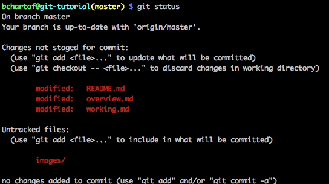
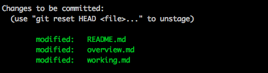
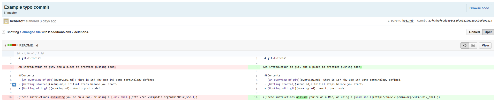
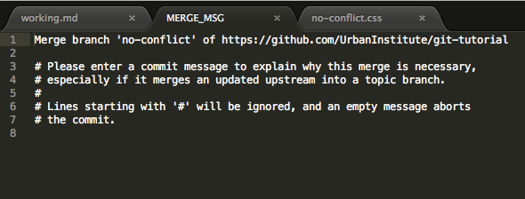
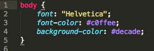
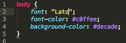
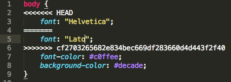

# Our Git Workflow

## Cloning a Repository
(I'm throwing around a lot of git specific terminology here, if you need a refresher you can check out [the overview](overview.md) or the [glossary](glossary.md))

1. To clone a repository onto your local computer, first head to the repo's home page (for this lesson, let's clone the [git-tutorial repo](https://github.com/UrbanInstitute/git-tutorial))

2. On the right-hand side of the page, find the green CODE button.

3. Copy the URL under the SSH tab. For this repo, it's "git@github.com:UrbanInstitute/git-tutorial.git". You will be prompted for your passphrase.

4. In a new Terminal window, run
	```bash
	git clone the_url
	```
	Where `the_url` is replaced with the URL you just copied.

5. In the Terminal, to move into the folder you just cloned (which is automatically named "git-tutorial"), run ```cd git-tutorial```

## Do some work!

1. Create, delete, or edit some files or folders. If you find typos etc. in these tutorials, feel free to edit them, but I also made a folder called [workspace](workspace) where you can create and edit files. Maybe make a CSS stylesheet, or write a list of instructions on how to make the best turkey sandwich ever. Whatever you want.

2. Now, from inside the `git-tutorial` folder run 
	```bash
	git status
	```
	And you should see something that looks similar to this:
	
	
	This gives you a lot of information, which I'll go through piece by piece.
	- `On branch master` means I am working in the main branch, called master. See below for instructions on creating new branches.
	- `Your branch is up-to-date with 'origin/master'` means that there are currently no changes ready to be pushed to the remote repo.
	- The `Changes not staged for commit` section lists three files that have changed (README.md, overview.md, and working.md) since my last push, but those changes have not been saved in a commit.
	- The `Untracked files` section lists files or folders that did not exist at the time of my last push, and have been created since then.

3. Before you commit the changes, you need to *add* them to the commit (sort of like putting them on deck). This step is part of the workflow in order to allow you to do a bunch of work, then separate it into a few different commits. For example, say you're working for a few hours on a graphic, in order to make it colorblind-compliant. You might add all the files in a `css` folder to one commit, then push it with the commit message "updated stylesheets to satisfy colorblind requirements." Then, you might add the `README.md` file or other documentation files to a new commit, and push it with the message "Documentation now describes colorblind compliance and resources." If that terminology seems way too dense, keep reading, and hopefully, things will become clear.

	You have a few options on how to add files to a commit.

	```bash
	git add -A
	```
	will add all files (the three .md files as well as everything in the `images` folder, in this case) to the commit. The `-A` stands for "all."

	*A handy aside: if there are files you never want to add to any commit, you can make a special hidden file inside the repo called `.gitignore`. In the [git-tutorial .gitigore](.gitignore), I tell git never ever to add the OS X file called [.DS_Store](http://en.wikipedia.org/wiki/.DS_Store) that lives in every folder and stores info like file icon positions, as well as any file that ends in .config (which might contain information like passwords that I never want to push to GitHub). With a good .gitignore, you can safely `git add -A` without worrying about accidentally adding files that shouldn't be committed*

	```bash
	git add *.md
	```
	will add any files that end in ".md" to the commit. In this example, this would add README.md, overview.md, and working.md.

	```bash
	git add README.md
	```
	will add just one file, README.md, to the commit.

	After you add all the .md files, you can run
	```bash
	git status
	```
	again, and you'll see that your changes are now ready to be committed, yay!
	

	In general, if you're not sure what the next step is, running `git status` a lot will give you an idea of what you should do.

4. Next, you need to commit the files (it's confusing that "commit" is both a verb and a noun. Really, you're "committing(v) the commit(n)" Ugh!) All commits should be described by a *commit message* that describes the changes you made, as a whole. Here's a simple example of a commit to git-tutorial, viewed on github.com:

Note a few things. The commit message is "Example typo commit", which tells us that I (bchartoff) made the commit in order to show you an example of a simple commit to fix a typo. README.md has been changed, and GitHub highlights lines with deletions in red (on the left), with the specific deleted characters in darker red. Added lines/ characters are shown in green on the right.

	The page for this commit is [here](https://github.com/UrbanInstitute/git-tutorial/commit/a7fc4bef6dde493c62fd60229ed2ebc9ef20ca14), or you can click on  at the top of the repo's main page (the number will be different of course).

	To make a commit, run the following command:
	```bash
	git commit -m "Here is where you put your commit message"
	```

	Now all those changes you made are stored in a single commit.

	Sometimes, you might do a lot of work for one commit, that's difficult to describe in a brief commit message. If so, you can make a longer, more organized commit message by just running:
	```bash
	git commit
	```
	(Note there's no `-m` flag) This will open up your text editor (check out the [setup](setup.md) tutorial for instructions on using Sublime as git's default editor), where you can write a longer commit message. Save and close the file, and your message will be stored. *Note: Long commit messages can be written using "GitHub flavored markdown", which is a way you can easily do things like make lists, bold or italicize, make headers, write code in those nifty little grey boxes that are all over this tutorial, etc. README files and files like this one are written in markdown, by saving a text file with the ".md" extension. You can also use [many html tags](https://github.com/github/markup/tree/master#html-sanitization) in a .md document. You can read more about [github flavored markdown here](https://help.github.com/articles/github-flavored-markdown/)*

	[Some people](http://robots.thoughtbot.com/5-useful-tips-for-a-better-commit-message) think you should always write long, detailed commit messages, although often they're not necessary, I think. Long commits are great when you did "lots of little things", like [this example](https://github.com/UrbanInstitute/git-tutorial/commit/7e1f885187e93627fa0f763adb75dd7bc04fb43a), or a [more realistic example](https://github.com/UI-Research/UI-Graphics/commit/860f33932b0ff7225e7f7900bf3c6db7a70e6b0f) from some work I did today on another project.

5. Ok, you've committed your changes (you can double check with another `git status`), now you need to push them to GitHub. First, run
	```bash
	git pull
	```
	This will pull changes down from the remote GitHub repo that other users have made since the last time you pushed or pulled. It's worth noting that almost everything you've done so far in this tutorial (`add`, `status`, `commit`) can be done without an internet connection. It's only when you push or pull that you're connecting to the remote GitHub, through the internet. Sometimes, the changes you are trying to pull down might contradict the changes you yourself have made, but not yet pushed. If that's the case, check out the [resolving a merge conflict](#resolving-a-merge-conflict) section below.

6. If the pull went OK, you can now run
	```bash
	git push
	```
	and your changes will be saved to GitHub! Hooray!

7. It's good practice to make lots of frequent commits, with descriptive messages, for a number of reasons:
	- Git makes it easy to rollback a project to the way it looked at the time of a certain commit. If you make lots of little commits, you can get make it easy to rollback a mistake or edit, without also erasing work you'd like to keep.

	- Looking at a well-kept commit history, it's easy to see who worked on a project, when they worked, what they did, and why they did it. If something's broken, or you have a question, you can go to the commit history to help diagnose the problem, or figure out who to ask for help.
	- The more often you push changes, the less likely it is you'll encounter a merge conflict.

Note:
Sometimes, you might want to pull changes down from github, and totally overwrite whatever local work you've done that is different from the remote version on github. <strong style="color: red"><span style="color: red">CAUTION:</span></strong> running this command is sort of the equivalent of closing a file and selecting "Don't Save," so make sure you really want to do it. Without adding, committing, pushing, or pulling, run
```bash
git reset --hard
```
And then
```bash
git pull
```
and your local repo will sync up with the remote GitHub repo, overwriting all your local changes.


## Working on branches

Sometimes, you might want to work on a separate version of a project, and make lots of frequent commits to the project (as you always should!), but you want the separate version to be isolated from the main version. The different versions of a git project are called **branches**, and the main version is always called the **master** branch. Every project has a master branch by default, but you can create as many new branches as you'd like. At any time, you can **merge** a branch back with master, pushing whatever changes you made in that branch to the master branch as well. You might want to branch a project for a number of reasons:
- Often, if you're working on a new feature for a project, you want to be able to work on that new feature without stepping on the toes of other users. Say, for example, you were updating all of the Urban styles to fit a new styleguide. You could make a `new-styleguide` branch, and work on that, but while you were working, other team members could continue pushing to the master branch, without having to use your half-finished wonky styles.
- Down the road, Urban graphics or features might be directly linked to a git repo (i.e. the live version of something on our site could live as a cloned repo on one of our servers). If/when that's the case, the best practice is to **never** push directly to master. Instead, we could push changes to a branch called "staging" or something similar. On a separate server (not the one that hosts the live version), we could have a git repo that is a clone of the staging branch. After internally viewing the staging version, we would then merge the staging branch with the master branch.

Ok, so let's get branching! In the examples below, Urban has just changed leadership, and our new president, Arahsay Artellway, wants us to convert all our documentation to Pig Latin. I decided to do the translation on a separate branch, so that while I'm working, people can continue to view the master branch without seeing my partway-done translations.
1. To create a new branch, called "piglatin" the command is:
	```bash
	git checkout -b piglatin
	```
	Next, let GitHub know that you have created a new branch, by running
	```bash
	git push --set-upstream origin piglatin
	```
	This is a slightly different use of the "push" command from above, since you're not pushing changed files, you're pushing the fact that a new branch exists. The `--set-upstream` flag means that now, every time you type `git push` as you're working in the piglatin branch on your computer, the changes get pushed to the piglatin branch on GitHub.

2. Now, you can work on the branch. In this example, I [painstakingly translated](http://www.snowcrest.net/donnelly/piglatin.html) all these markdown files into piglatin. At first, these kind of changes might feel weird or alarming. It feels like you're deleting all your hard work! But remember, the two different branches store two entirely different versions of the repo. While you make changes in `piglatin`, the `master` branch stays the same.

3. On a branch, the git workflow is exactly the same as described above. As you change files, `add`, `commit`, `pull`, and `push`.

4. If you want to switch branches, you use the `checkout` command again, but without the `-b` flag (b stands for "branch" and is just used to create a *new* branch). It's <strong style="color: red">important to remember</strong> to commit and push your changes before switching to another branch. In some cases (and it's a bit complex to go into the specifics of which cases), not committing and pushing can make you lose local changes (i.e. changes you've made on your own computer, but haven't yet synced up with GitHub), when switching between branches. Once you've committed and pushed, run
	```bash
	git checkout piglatin
	```
	to switch to the piglatin branch, or
	```bash
	git checkout master
	```
	to switch back to the main branch.

5. Sometimes, you will want to combine two branches together. There are two variations on why and when you'd do this:

#### Merging from master into a branch

Sometimes, you'll want to keep working on a new branch, but also pull in changes that other users have made to the master branch. Using the example from above, say you're on a branch called `new-styleguide`, where you're doing some major Urban CSS updates. As you're working, folks have been building a new feature over on the `master` branch. You want to pull that new feature into your branch, so you can see how your new styles fit with it.

1. Make sure you're on the `new-styleguide` branch, or switch to it with
	```bash
	git checkout new-styleguide
	```

2. Run
	```bash
	git merge master
	```
	This pulls changes *from* master *into* new-styleguide.

3. This is called **merging** the two branches, and you might need to resolve differences that contradict each other (see below for this process).

#### Merging a branch into master
So you've finished all your work updating the new styleguide on your branch. High five! If you want to update the master branch with all your changes, the process is just the reverse of above:
1. Make sure you're on the `master` branch
	```bash
	git checkout master
	```

2. Then pull in your changes
	```bash
	git merge new-styleguide
	```

### Deleting a branch
Finally, there are times you might want to delete a branch. Major branches, like `new-styleguide` or other big features, might be good to keep around. Lots of software products have branches for each new version (1.0, 2.0 etc), and looking back at those branches can often be helpful, to help diagnose bugs, or even let users roll back to old versions of the software. But little branches, for small fixes or updates, can sometimes be deleted. To delete a branch:
1. Switch to a branch other than the one you want to delete using `git checkout`

2. Running
	```bash
	git branch
	```
	will show you a list of all the branches on the project.

3. Then, to delete a branch called `temporary-stuff`, for example
	```bash
	git branch -D `temporary-stuff`
	```

## Resolving a merge conflict

When you merge a branch &mdash; either merging changes another user made on a single branch or merging one branch into another &mdash; things will easily go smoothly or slightly less smoothly.

### Merging with no conflicts

If the files you merge don't conflict with each other, git does the merge automatically. When you run `git pull` or another command that causes the merge to take place, a text file will open up that looks like this (in this example, in opened in Sublime, see [the setup file](setup.md) for instructions on using Sublime as git's editor):



Close the file and you're done!

### Merging with conflicts

Ok, let's look at an example of code that would cause a merge conflict. Let's say this css file, called `styles.css`, is on the `master` branch:



And, on the `new-styleguide` branch, the **same** css file looks like this:



As you can see, the branch css has switched fonts from Helvetica to Lato. When you try to merge these two files together, git doesn't know which one is correct, i.e. they contain *conflicting* information. So you need to manually tell git which version is correct.

When you try to `git pull` to merge these two files, you will get an error message. It could say a few different things, but in general might look like:
```bash
CONFLICT (content): Merge conflict in styles.css
Automatic merge failed; fix conflicts and then commit the result.
```

So, there's conflicting information in `styles.css`, as we've seen. Open the file in a text editor (like Sublime) and you'll see this wacky-looking business:



This is a special syntax that git puts into your files to show you where merge conflicts exist. The syntax can be read like this:

```bash
this;
code;
is;
OK;
<<<<<<< HEAD
Version 1 of conflicting code
=======
Version 2 of conflicting code
>>>>>>> an-id-number-for-this-merge-conflict
this;
code;
is;
ok;
```

Look back at the actual example above to make sure the syntax makes sense.

To resolve this conflict:
1. Choose which version of the code you want to keep. Say, for example, the font should be "Lato".
2. Delete the incorrect line (`font: "Helvetica";`)
3. Delete the conflict markers. I.e. delete the lines `<<<<<<< HEAD`, `=======`, and `>>>>>>> be283f461d967160c94c1d298e568aa458e1b529`
4. Save the file.
5. Now commit this file just like we've done above:
```bash
git add styles.css
git commit -m "resolved merge conflict"
git push
```

There are [tools out there](http://www.sublimerge.com/) that can make the merge process a little less painful, and if you need to merge a lot we can talk about how to use them. But for now, it's best that you understand exactly what's going on when a conflict arises, and how to fix it by hand.

Note: it is possible to accidentally commit and push merge markers (`<<<<<<<`, `=======`, and `>>>>>>>). You can always delete the lines and re-push, but if you find yourself doing this, or want to make sure you never do, [bobgilmore](https://github.com/bobgilmore/githooks) has written some scripts to make sure you never push those markers, and [konklone](https://github.com/konklone/dontcommit) has a much lighter weight and simple solution.

## That's it!

You are now officially an amazing git wizard. Good work. I know it seems like a lot of weird workflows and crazy terminology right now, but believe me, once you get used to it, it becomes invaluable to your workflow. 2 years ago I didn't know a `commit` from a `pull`, but once I started using git every day, life because so much better. Good luck, and I'm here to help either in person (for Urban folks) or here on GitHub, feel free to open an issue to chat.
